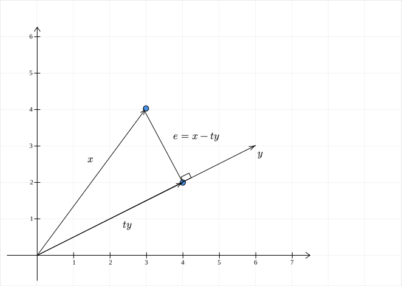

# Cauchy-Schwarz Inequality

Cauchy-Schwarz inequality is a popular inequality that can be derived from the idea of projections. This is the statement of the inequality:

## Statement

If $x$ and $y$ are two vectors in $\mathbb{R}^{n}$, then:

$$
|x^T y| \leq ||x|| \cdot ||y||
$$

## Projection

If $y = 0$, then $x^Ty = 0$ and $||y||=0$. The inequality holds in this case. For the rest of the proof, we will assume that $y \neq 0$. 

{width="1000"}

First, let us look at the projection of $x$ on $y$. This is going to be some scalar multiple of $y$ that we call $ty$. Since the error vector is orthogonal to $y$, we have:

$$
\begin{aligned}
e^T y &= 0\\\\
(x - ty)^T y &= 0\\\\
(x^T - ty^T) y &=0\\\\
x^Ty - ty^Ty &= 0\\\\
\therefore\ t &= \cfrac{x^Ty}{y^Ty}
\end{aligned}
$$

Note that we have used the fact that $y^Ty > 0$ in the last step. The projection of $x$ on $y$ is therefore:

$$
\cfrac{x^Ty}{y^Ty} y
$$

Now that we have the projection, we can move to the inequality. 

## Inequality

The basic idea behind the inequality is that the length of the error vector, $||e||$, is greater than or equal to zero. It is zero if and only if $x$ is parallel to the vector $y$:

$$
\begin{aligned}
||e||^2 &\geq 0\\\\
e^T e &\geq 0\\\\
(x - ty)^T(x - ty) &\geq 0\\\\
x^Tx - 2 t x^T y + t^2y^Ty &\geq 0
\end{aligned}
$$

Let us now substitute $t = \cfrac{x^Ty}{y^Ty}$:

$$
\begin{aligned}
x^Tx - \cfrac{(x^Ty)^2}{y^Ty} &\geq 0\\\\
(x^T y)^2 &\leq (x^Tx) (y^Ty)\\\\
|x^Ty| &\leq ||x|| \cdot ||y||
\end{aligned}
$$

The equality occurs when $x = ty$ or when $x$ is parallel (anti-parallel) to $y$.

