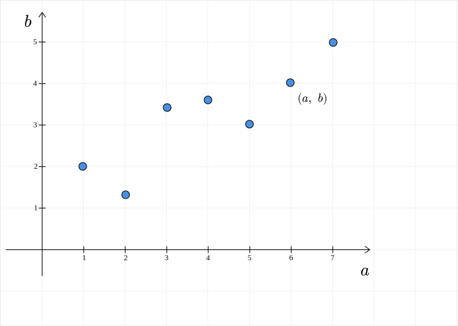
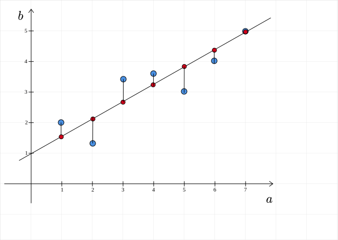

# Course Outline

- Week 1: Introduction to ML
- Week 2: Recap of calculus for ML
- Weeks 3 - 6: Linear algebra for ML
- Weeks 7 - 9: Optimization for ML
- Weeks 10 - 12: Probability and Statistics for ML

# Session Outline

- Linear Algebra for ML
- Regression problem
  - Dataset
- Linear regression model
- Algebra
  - $X \theta = 0$
  - $X \theta = y$
  - $X \theta \approx y$
- Geometry
  - Best-fit
  - Projections

# Linear Algebra for ML

# Linear Algebra for ML

Why should we study linear algebra in ML?

# Linear Algebra for ML

Why should we study linear algebra in ML?

::: {.columns align=center}

::: {.column width="100%"}

 

 

## Data

:::

:::

# Linear Algebra for ML

Housing dataset

- lattitude
- longitue
- age
- num_of_rooms
- area
- distance_from_school

# Linear Algebra for ML

$1$ house

::: {.columns align=center}

::: {.column width="50%"}

| Attributes/Target | Values |
| ----------------- | ------ |
| lattitude         | 12.9   |
| longitude         | 80.2   |
| age               | 3      |
| rooms             | 2      |
| area              | 1000   |
| distance          | 3      |
| price             | 40     |

:::

::: {.column width="50%"}

:::

:::

# Linear Algebra for ML

$1$ house

::: {.columns align=center}

::: {.column width="50%"}

| Attributes/Target | Values |
| ----------------- | ------ |
| lattitude         | 12.9   |
| longitude         | 80.2   |
| age               | 3      |
| rooms             | 2      |
| area              | 1000   |
| distance          | 3      |
| price             | 40     |

:::

::: {.column width="50%"}
$$
\begin{bmatrix}
12.9\\
80.2\\
3\\
2\\
1000\\
3\\
\end{bmatrix}
$$

 

Vector

:::

:::

# Linear Algebra for ML

$100$ houses?

# Linear Algebra for ML

$100$ houses

::: {.columns align=center}

::: {.column width="100%"}

$$
\begin{bmatrix}
12.9 & 80.2 & 3 & 2 & 1000 & 3\\
\vdots & \vdots & \vdots & \vdots & \vdots & \vdots\\
14.3 & 75.9 & 30 & 2 & 1200 & 5\\
\vdots & \vdots & \vdots & \vdots & \vdots & \vdots\\
20.8 & 90.5 & 1 & 3 & 1500 & 2
\end{bmatrix}
$$

 

$100 \times 6$ matrix

Each row is a house

:::

::: {.column width="0%"}

:::

:::

# Regression

::: {.columns align=center}

::: {.column width="50%"}

**Given**

 

lattitude

longitue

age

num_of_rooms

area

distance_from_school

:::

::: {.column width="50%"}

**Predict**

  

 

selling_price

:::

:::

# Regression

::: {.columns align=center}

::: {.column width="50%"}

**Given**

  
$$
\huge{x \in \mathbb{R}^{6}}
$$
:::

::: {.column width="50%"}

**Predict**

  
$$
\huge{y \in \mathbb{R}}
$$

:::

:::

# Regression

::: {.columns align=center}

::: {.column width="50%"}

**Given**

  
$$
\huge{x \in \mathbb{R}^{n}}
$$
:::

::: {.column width="50%"}

**Predict**

  
$$
\huge{y \in \mathbb{R}}
$$

:::

:::

# Regression

::: {.columns align=center}

::: {.column width="50%"}

**Given**

  
$$
\huge{x \in \mathbb{R}^{n}}
$$
 

 

Feature-vector

:::

::: {.column width="50%"}

**Predict**

  
$$
\huge{y \in \mathbb{R}}
$$

  

Label

:::

:::

# Model

::: {.columns align=center}

::: {.column width="100%"}
$$
\huge{f: \mathbb{R}^{n}} \rightarrow \mathbb{R}
$$
:::

::: {.column width="0%"}

right

:::

:::

# Model

::: {.columns align=center}

::: {.column width="100%"}
$$
\huge{f: \mathbb{R}^{n}} \rightarrow \mathbb{R}
$$
  
$$
\huge{f(x)=y}
$$

:::

::: {.column width="0%"}

right

:::

:::

# Model

::: {.columns align=center}

::: {.column width="100%"}
$$
\huge{f: \mathbb{R}^{n}} \rightarrow \mathbb{R}
$$
  
$$
\huge{f(x)=y}
$$

  

Learning a model?

:::

::: {.column width="0%"}

:::

:::

# Labeled Dataset

Data for $m$ houses; each house is described by $n$ features:

  

::: {.columns align=center}

::: {.column width="50%"}
$$
X = \begin{bmatrix}
\cdots & x_1 & \cdots\\
& \vdots &\\
\cdots & x_m & \cdots\\
\end{bmatrix}
$$
  

$m \times n$ data-matrix (feature matrix)

:::

::: {.column width="50%"}
$$
y = \begin{bmatrix}
y_1\\
\vdots\\
y_m
\end{bmatrix}
$$

  

$m \times 1$ label vector

:::

:::

# Linear regression

::: {.columns align=center}

::: {.column width="100%"}

  
$$
\large{\text{Selling-price} = 2 \times \text{Area} - 0.2 \times \text{Distance} + \text{Constant}}
$$

:::

::: {.column width="0%"}

right

:::

:::

# Linear regression

::: {.columns align=center}

::: {.column width="100%"}

  
$$
\begin{aligned}
y &= \theta_0 + x_1 \theta_1 + x_2 \theta_2 + x_3\theta_3 + x_4 \theta_4 + x_5 \theta_5 + x_6 \theta_6 \\\\
\end{aligned}
$$

:::

::: {.column width="0%"}

right

:::

:::

# Linear regression

::: {.columns align=center}

::: {.column width="100%"}

  
$$
\begin{aligned}
y &= \theta_0 + x_1 \theta_1 + x_2 \theta_2 + x_3\theta_3 + x_4 \theta_4 + x_5 \theta_5 + x_6 \theta_6 \\\\
&= \theta^T x
\end{aligned}
$$

:::

::: {.column width="0%"}

right

:::

:::

# Linear regression

::: {.columns align=center}

::: {.column width="100%"}

  
$$
y = \theta^T x = \begin{bmatrix}
\theta_0 & \theta_1 & \theta_2 & \theta_3 & \theta_4 & \theta_5 & \theta_6
\end{bmatrix}\begin{bmatrix}
1\\
x_1\\
x_2\\
x_3\\
x_4\\
x_5\\
x_6
\end{bmatrix}
$$

:::

::: {.column width="0%"}

right

:::

:::

# Linear regression

::: {.columns align=center}

::: {.column width="100%"}

  
$$
\huge{f(x) = \theta^T x}
$$

  

$\large \theta$ is a vector of parameters (weights) of the model

:::

::: {.column width="0%"}

right

:::

:::

# Linear regression

::: {.columns align=center}

::: {.column width="100%"}

  
$$
y = \theta^T x = \begin{bmatrix}
\theta_0 & \theta_1 & \theta_2 & \theta_3 & \theta_4 & \theta_5 & \theta_6
\end{bmatrix}\begin{bmatrix}
1\\
x_1\\
x_2\\
x_3\\
x_4\\
x_5\\
x_6
\end{bmatrix}
$$

:::

::: {.column width="0%"}

right

:::

:::

# Linear regression

::: {.columns align=center}

::: {.column width="100%"}

  
$$
y = x^T \theta = \begin{bmatrix}
1 & x_1 & x_2 & x_3 & x_4 & x_5 & x_6
\end{bmatrix} \begin{bmatrix}
\theta_0 \\ \theta_1 \\ \theta_2 \\ \theta_3 \\ \theta_4 \\ \theta_5 \\ \theta_6
\end{bmatrix}
$$

:::

::: {.column width="0%"}

right

:::

:::

# Linear regression

::: {.columns align=center}

::: {.column width="100%"}

  
$$
\begin{bmatrix}
y_{1}\\
\vdots\\
y_{100}
\end{bmatrix}= \begin{bmatrix}
1 & x_{1,1} & x_{1,2} & x_{1,3} & x_{1,4} & x_{1,5} & x_{1,6}\\
\vdots & \vdots & \vdots & \vdots & \vdots & \vdots & \vdots\\
1 & x_{100,1} & x_{100,2} & x_{100,3} & x_{100,4} & x_{100,5} & x_{100,6}\\
\end{bmatrix}\begin{bmatrix}
\theta_0\\
\theta_1\\
\theta_2\\
\theta_3\\
\theta_4\\
\theta_5\\
\theta_6
\end{bmatrix}
$$

  

:::

::: {.column width="0%"}

right

:::

:::

# Linear regression

::: {.columns align=center}

::: {.column width="100%"}

 

  

 
$$
\huge{X \theta} = y
$$
  

:::

::: {.column width="0%"}

right

:::

:::

# Linear regression

::: {.columns align=center}

::: {.column width="100%"}

 

  

 
$$
\huge{X \theta} = y
$$
  

Enter Linear Algebra

:::

::: {.column width="0%"}

right

:::

:::

# Setting

::: incremental

- $X$ is a data-matrix of dimensions $m \times n$
- $y$ is a column-vector of size $m$
- $\theta \in \mathbb{R}^n$
- $X\theta \in \mathbb{R}^{m}$

:::

::: {.columns align=center}

::: {.column width="100%"}

 

 
$$
\huge{X \theta} = y
$$
:::

::: {.column width="0%"}

right

:::

:::

# $X \theta = 0$

::: {.columns align=center}

::: {.column width="100%"}

 

  
$$
\huge{X \theta = 0}
$$
:::

::: {.column width="0%"}

right

:::

:::

# $X \theta = 0$

::: {.columns align=left}

::: {.column width="50%"}

  

If:

- $X \theta_1 = 0$
- $X \theta_2 = 0$

:::

::: {.column width="50%"}

:::

:::

# $X \theta = 0$

::: {.columns align=left}

::: {.column width="50%"}

  

If:

- $X \theta_1 = 0$
- $X \theta_2 = 0$

:::

::: {.column width="50%"}

  

Then:

- $X (\theta_1 + \theta_2) = X\theta_1 + X \theta_2 = 0$
- $X(k \theta_1) = k(X \theta_1) = 0$

:::

:::

# $X \theta = 0$

::: {.columns align=center}

::: {.column width="100%"}

 

 

The set of all solutions of $X \theta = 0$ is $\underline{} \underline{} \underline{} \underline{}$ .

:::

::: {.column width="0%"}

right

:::

:::

# $X \theta = 0$

::: {.columns align=center}

::: {.column width="100%"}

 

 

The set of all solutions of $X \theta = 0$ is $N(X)$.

:::

::: {.column width="0%"}

right

:::

:::

# $X \theta = 0$

::: {.columns align=center}

::: {.column width="100%"}

 

 

The set of all solutions of $X \theta = 0$ is $N(X)$.

 

 

Find a basis for $N(X)$.

:::

::: {.column width="0%"}

right

:::

:::

# $X \theta = 0$

::: {.columns align=center}

::: {.column width="100%"}

 

 

The set of all solutions of $X \theta = 0$ is $N(X)$.

 

 

Find a basis for $N(X)$.

 

 

$N(X) = \text{span}(B)$

:::

::: {.column width="0%"}

right

:::

:::

# $X \theta = 0$

::: {.columns align=center}

::: {.column width="100%"}

 

  
$$
\huge{X \theta = 0}
$$
   

Gaussian elimination

:::

::: {.column width="0%"}

right

:::

:::

# Row-operations

::: incremental

- swap two rows
- scale a row by a non-zero constant
- add a scalar multiple of a row to another row

:::

# Example

::: {.columns align=center}

::: {.column width="100%"}

   
$$
X = \begin{bmatrix}
1 & 0 & -1 & 0\\
2 & 1 & 0 & 1\\
3 & 1 & -1 & 1
\end{bmatrix}
$$

:::

::: {.column width="0%"}

right

:::

:::

# Example: Step-1

::: {.columns align=center}

::: {.column width="100%"}

   
$$
\begin{bmatrix}
1 & 0 & -1 & 0\\
2 & 1 & 0 & 1\\
3 & 1 & -1 & 1
\end{bmatrix} \underrightarrow{R_2 \rightarrow R_2-2R_1} 
\begin{bmatrix}
1 & 0 & -1 & 0\\
0 & 1 & 2 & 1\\
3 & 1 & -1 & 1
\end{bmatrix}
$$

:::

::: {.column width="0%"}

right

:::

:::

# Example: Step-2

::: {.columns align=center}

::: {.column width="100%"}

   
$$
\begin{bmatrix}
1 & 0 & -1 & 0\\
0 & 1 & 2 & 1\\
3 & 1 & -1 & 1
\end{bmatrix} \underrightarrow{R_3 \rightarrow R_3-3R_1} 
\begin{bmatrix}
1 & 0 & -1 & 0\\
0 & 1 & 2 & 1\\
0 & 1 & 2 & 1
\end{bmatrix}
$$

:::

::: {.column width="0%"}

right

:::

:::

# Example: Step-3

::: {.columns align=center}

::: {.column width="100%"}

   
$$
\begin{bmatrix}
1 & 0 & -1 & 0\\
0 & 1 & 2 & 1\\
0 & 1 & 2 & 1
\end{bmatrix} \underrightarrow{R_3 \rightarrow R_3 - R_2} 
\begin{bmatrix}
1 & 0 & -1 & 0\\
0 & 1 & 2 & 1\\
0 & 0 & 0 & 0
\end{bmatrix}
$$

:::

::: {.column width="0%"}

right

:::

:::

# Row-echelon matrix

::: {.columns align=center}

::: {.column width="100%"}

   
$$
\begin{bmatrix}
1 & 0 & -1 & 0\\
0 & 1 & 2 & 1\\
0 & 0 & 0 & 0
\end{bmatrix}
$$

:::

::: {.column width="0%"}

right

:::

:::

# Row-echelon matrix

::: {.columns align=center}

::: {.column width="100%"}

   
$$
\begin{bmatrix}
\color{blue}{1} & 0 & -1 & 0\\
0 & \color{blue}{1} & 2 & 1\\
0 & 0 & 0 & 0
\end{bmatrix}
$$

:::

::: {.column width="0%"}

right

:::

:::

# Solve

::: {.columns align=center}

::: {.column width="100%"}

   
$$
\begin{bmatrix}
\color{blue}{1} & 0 & -1 & 0\\
0 & \color{blue}{1} & 2 & 1\\
0 & 0 & 0 & 0
\end{bmatrix}\begin{bmatrix}
\color{blue}{\theta_1}\\
\color{blue}{\theta_2}\\
\theta_3\\
\theta_4
\end{bmatrix} = \begin{bmatrix}
0\\
0\\
0\\
0
\end{bmatrix}
$$

:::

::: {.column width="0%"}

right

:::

:::

# Algorithm

::: {.columns align=left}

::: {.column width="100%"}

$B = \{ \}$

::: incremental

For each independent variable $\theta_i$:

- Set $\theta_i = 1$ and $\theta_j = 0$ for all independent variables, $j \neq i$
- Solve for the dependent variables        
- Add $\theta$ to $B$

:::

:::

::: {.column width="0%"}

right

:::

:::

# Solved

::: {.columns align=center}

::: {.column width="50%"}

  
$$
\begin{bmatrix}
\color{blue}{1} & 0 & -1 & 0\\
0 & \color{blue}{1} & 2 & 1\\
0 & 0 & 0 & 0
\end{bmatrix}\begin{bmatrix}
\color{blue}{\theta_1}\\
\color{blue}{\theta_2}\\
\theta_3\\
\theta_4
\end{bmatrix} = \begin{bmatrix}
0\\
0\\
0\\
0
\end{bmatrix}
$$

:::

::: {.column width="50%"}

  
$$
B = \left \{ \begin{bmatrix}1\\
-2\\
1\\
0\end{bmatrix}, \begin{bmatrix}0\\
-1\\
0\\
1\end{bmatrix} \right \}
$$

:::

:::

# $X \theta = y$

::: {.columns align=center}

::: {.column width="100%"}

   

When will $X \theta = y$ have a solution?

:::

::: {.column width="0%"}

right

:::

:::

# $X \theta = y$

::: {.columns align=center}

::: {.column width="50%"}

   
$$
\begin{bmatrix}
\big\vert &  & \big\vert\\
x_1 & \cdots & x_n\\
\big\vert & & \big\vert
\end{bmatrix} \begin{bmatrix}
\theta_1\\
\vdots\\
\theta_n
\end{bmatrix} = \begin{bmatrix}
y_1\\
\vdots\\
y_m
\end{bmatrix}
$$

:::

::: {.column width="50%"}

:::

:::

# $X \theta = y$

::: {.columns align=center}

::: {.column width="50%"}

   
$$
\begin{bmatrix}
\big\vert &  & \big\vert\\
x_1 & \cdots & x_n\\
\big\vert & & \big\vert
\end{bmatrix} \begin{bmatrix}
\theta_1\\
\vdots\\
\theta_n
\end{bmatrix} = \begin{bmatrix}
y_1\\
\vdots\\
y_m
\end{bmatrix}
$$

:::

::: {.column width="50%"}

   
$$
\theta_1 x_1 + \cdots + \theta_n x_n = y
$$

:::

:::

# $X \theta = y$

::: {.columns align=center}

::: {.column width="50%"}

   
$$
\begin{bmatrix}
\big\vert &  & \big\vert\\
x_1 & \cdots & x_n\\
\big\vert & & \big\vert
\end{bmatrix} \begin{bmatrix}
\theta_1\\
\vdots\\
\theta_n
\end{bmatrix} = \begin{bmatrix}
y_1\\
\vdots\\
y_m
\end{bmatrix}
$$

:::

::: {.column width="50%"}

   
$$
\theta_1 x_1 + \cdots + \theta_n x_n = y
$$
  
$$
y \in C(X)
$$

:::

:::

# $X \theta = y$

::: {.columns align=center}

::: {.column width="100%"}

   

When will $X \theta = y$ have a solution?

  

$y \in C(X)$

:::

::: {.column width="0%"}

right

:::

:::

# $X \theta = y$

::: {.columns align=left}

::: {.column width="50%"}

  

::: incremental

- $X$ is the data-matrix
- $m \times n$
- $m$ data-points, $n$ features

:::

:::

::: {.column width="50%"}

:::

:::

# $X \theta = y$

::: {.columns align=left}

::: {.column width="50%"}

  

- $X$ is the data-matrix
- $m \times n$
- $m$ data-points, $n$ features

:::

::: {.column width="50%"}

 

Typical dataset:

::: incremental

- $m = 10000$
- $n = 10$
- Can $10$ vectors span $\mathbb{R}^{10000}$?

:::

:::

:::

# $X \theta = y$

::: {.columns align=left}

::: {.column width="50%"}

  

- $X$ is the data-matrix
- $m \times n$
- $m$ data-points, $n$ features

:::

::: {.column width="50%"}

 

Typical dataset:

- $m = 10000$
- $n = 10$
- Can $10$ vectors span $\mathbb{R}^{10000}$?

:::

:::

::: {.columns align=center}

::: {.column width="100%"}

  

$X \theta = y$ is generally unsolvable.

:::

::: {.column width="0%"}

right

:::

:::

# $X \theta \approx y$

::: {.columns align=left}

::: {.column width="100%"}

:::

::: {.column width="0%"}

right

:::

:::

# $X \theta \approx y$

::: {.columns align=left}

::: {.column width="100%"}

What does the $\approx$ symbol mean?

::: incremental

- $1.234 \approx 1$
- $1.234 \approx 1.2$
- $1.234 \approx 1.23$

::: 

:::

::: {.column width="0%"}

right

:::

:::

# $X \theta \approx y$

::: {.columns align=left}

::: {.column width="50%"}

  
$$
\hat{y} \approx y
$$
:::

::: {.column width="50%"}

:::

:::

# $X \theta \approx y$

::: {.columns align=left}

::: {.column width="50%"}

  
$$
\hat{y} \approx y
$$
:::

::: {.column width="50%"}

  
$$
||\hat{y} - y||
$$

:::

:::

# $X \theta \approx y$

::: {.columns align=left}

::: {.column width="50%"}

  
$$
\hat{y} \approx y
$$
:::

::: {.column width="50%"}

  
$$
||\hat{y} - y||^2
$$

:::

:::

# $X \theta \approx y$

::: {.columns align=left}

::: {.column width="50%"}

  
$$
\hat{y} \approx y
$$
:::

::: {.column width="50%"}

  
$$
||\hat{y} - y||^2 = (\hat{y}_1 - y_1)^2 + \cdots + (\hat{y}_m - y_m)^2
$$

:::

:::

# $X \theta \approx y$

::: {.columns align=left}

::: {.column width="50%"}

  
$$
X\hat{\theta} \approx y
$$
:::

::: {.column width="50%"}

  
$$
\hat{\theta} = \arg \min \limits_{\theta} ||X\theta - y||^2
$$
:::

:::

# Loss

::: {.columns align=center}

::: {.column width="100%"}

  

 
$$
\huge{L = ||X \theta - y||^2}
$$

:::

::: {.column width="0%"}

right

:::

:::

# Loss

::: {.columns align=center}

::: {.column width="100%"}

  

 
$$
\begin{aligned}
L &= ||X \theta - y||^2
\end{aligned}
$$

:::

::: {.column width="0%"}

right

:::

:::

# Loss

::: {.columns align=center}

::: {.column width="100%"}

  

 
$$
\begin{aligned}
L &= ||X \theta - y||^2\\\\
&= (X \theta - y)^T (X \theta - y)
\end{aligned}
$$

:::

::: {.column width="0%"}

right

:::

:::

# Optimization

::: {.columns align=left}

::: {.column width="50%"}

  

 
$$
\begin{aligned}
L &= (X \theta - y)^T (X \theta - y)
\end{aligned}
$$
:::

::: {.column width="50%"}

:::

:::

# Optimization

::: {.columns align=left}

::: {.column width="50%"}

  

 
$$
\begin{aligned}
L &= (X \theta - y)^T (X \theta - y)
\end{aligned}
$$
:::

::: {.column width="50%"}

  
$$
\nabla_{\theta} L = \begin{bmatrix}
\cfrac{\partial L}{\partial \theta_1}\\
\vdots\\
\cfrac{\partial L}{\partial \theta_n}
\end{bmatrix} = 0
$$
:::

:::

# Optimization

::: {.columns align=left}

::: {.column width="50%"}

  

 
$$
\begin{aligned}
L &= (X \theta - y)^T (X \theta - y)
\end{aligned}
$$
:::

::: {.column width="50%"}

  

 
$$
\nabla_{\theta} L = 2(X^TX)\theta - 2X^Ty = 0
$$
:::

:::

# Normal Equations

::: {.columns align=center}

::: {.column width="100%"}

   
$$
\huge{(X^TX)\theta = X^Ty}
$$

:::

::: {.column width="0%"}

right

:::

:::

# Solution

::: {.columns align=center}

::: {.column width="100%"}

   

If $X^TX$ is invertible, then:

 
$$
\hat{\theta} = (X^TX)^{-1} X^Ty
$$
  

When is $X^TX$ invertible?

:::

::: {.column width="0%"}

right

:::

:::

# $X^TX$

::: {.columns align=left}

::: {.column width="50%"}

::: incremental

- $n \times n$ matrix
- Symmetric

:::

:::

::: {.column width="50%"}

:::

:::

# $X^TX$

::: {.columns align=left}

::: {.column width="50%"}

 

 

 
$$
N(X) = N(X^TX)
$$
:::

::: {.column width="50%"}

:::

:::

# $X^TX$

::: {.columns align=left}

::: {.column width="50%"}

 

 

 
$$
N(X) = N(X^TX)
$$
:::

::: {.column width="50%"}

<u>Proof</u>

If $\theta \in N(X)$:

::: incremental

- $X\theta =0$
- $X^TX \theta = 0$

:::

:::

:::

# $X^TX$

::: {.columns align=left}

::: {.column width="50%"}

 

 

 
$$
N(X) = N(X^TX)
$$
:::

::: {.column width="50%"}

<u>Proof</u>

If $\theta \in N(X)$:

- $X\theta =0$
- $X^TX \theta = 0$

If $\theta \in N(X^T X)$

::: incremental

- $X^TX \theta = 0$
- $\theta^T X^TX \theta = 0$
- $(X \theta)^T (X \theta) = 0$
- $X \theta = 0$

:::

:::

:::

# $X^TX$

::: {.columns align=left}

::: {.column width="50%"}

  

 

If $\text{rank}(X) = n$, $X^TX$ is invertible

:::

::: {.column width="50%"}

<u>Proof</u>

If $\text{rank}(X) = n$:

::: incremental

- $\text{nullity}(X) = 0$
- $\text{nullity}(X^TX) = 0$
- $\text{rank}(X^TX) = n$
- $X^TX$ is full rank, hence invertible

:::

:::

:::

# Geometry

::: {.columns align=center}

::: {.column width="100%"}

   

What does a linear regression model look like?

:::

::: {.column width="0%"}

right

:::

:::

# Data

::: {.columns align=center}

::: {.column width="100%"}

{width="800"}

:::

::: {.column width="0%"}

right

:::

:::

# Linear model

::: {.columns align=center}

::: {.column width="100%"}

{width="800"}

:::

::: {.column width="0%"}

right

:::

:::

# Errors

::: {.columns align=center}

::: {.column width="100%"}

{width="800"}

:::

::: {.column width="0%"}

right

:::

:::

# Projections

::: {.columns align=center}

::: {.column width="50%"}
$$
(X^TX)\hat{\theta} = X^Ty
$$
  

$X \hat{\theta}$ is an approximation for $y$

  

How are $X \hat{\theta}$ and $y$ related geometrically?

:::

::: {.column width="50%"}

:::

:::

# Projections

::: {.columns align=center}

::: {.column width="50%"}
$$
(X^TX)\hat{\theta} = X^Ty
$$
  

$X \hat{\theta}$ is an approximation for $y$

  

How are $X \hat{\theta}$ and $y$ related geometrically?

:::

::: {.column width="50%"}

   
$$
X = \begin{bmatrix}
2 & 6\\
1 & 3
\end{bmatrix}, y = \begin{bmatrix}
3\\
4
\end{bmatrix}, X \hat{\theta} = \begin{bmatrix}
4\\
2
\end{bmatrix}
$$
:::

:::

# Projections

::: {.columns align=left}

::: {.column width="70%"}

{width="700"}

:::

::: {.column width="30%"}

  

 
$$
X = \begin{bmatrix}
2 & 6\\
1 & 3
\end{bmatrix}, y = \begin{bmatrix}
3\\
4
\end{bmatrix}, X \hat{\theta} = \begin{bmatrix}
4\\
2
\end{bmatrix}
$$

:::

:::

# Projections

::: {.columns align=left}

::: {.column width="70%"}

{width="700"}

:::

::: {.column width="30%"}

  

 
$$
X = \begin{bmatrix}
2 & 6\\
1 & 3
\end{bmatrix}, y = \begin{bmatrix}
3\\
4
\end{bmatrix}, X \hat{\theta} = \begin{bmatrix}
4\\
2
\end{bmatrix}
$$

:::

:::

# Projections

::: {.columns align=left}

::: {.column width="50%"}

{width="700"}

:::

::: {.column width="50%"}

  

 
$$
e = y - X \hat{\theta}
$$
  
$$
e \perp C(X)
$$

:::

:::

# Projections

::: {.columns align=center}

::: {.column width="50%"}

  
$$
X = \begin{bmatrix}
\vert & & \vert\\
x_1 & \cdots & x_n\\
\vert & & \vert
\end{bmatrix}
$$
  

:::

::: {.column width="50%"}

:::

:::

# Projections

::: {.columns align=center}

::: {.column width="50%"}

  
$$
X = \begin{bmatrix}
\vert & & \vert\\
x_1 & \cdots & x_n\\
\vert & & \vert
\end{bmatrix}
$$
  
$$
e \perp x_i
$$

:::

::: {.column width="50%"}

:::

:::

# Projections

::: {.columns align=center}

::: {.column width="50%"}

  
$$
X = \begin{bmatrix}
\vert & & \vert\\
x_1 & \cdots & x_n\\
\vert & & \vert
\end{bmatrix}
$$
  
$$
e \perp x_i
$$

:::

::: {.column width="50%"}

 
$$
x_i^T e = 0
$$
:::

:::

# Projections

::: {.columns align=center}

::: {.column width="50%"}

  
$$
X = \begin{bmatrix}
\vert & & \vert\\
x_1 & \cdots & x_n\\
\vert & & \vert
\end{bmatrix}
$$
  
$$
e \perp x_i
$$

:::

::: {.column width="50%"}

 
$$
x_i^T e = 0
$$
 
$$
X^T e = 0
$$
:::

:::

# Projections

::: {.columns align=center}

::: {.column width="50%"}

  
$$
X = \begin{bmatrix}
\vert & & \vert\\
x_1 & \cdots & x_n\\
\vert & & \vert
\end{bmatrix}
$$
  
$$
e \perp x_i
$$

:::

::: {.column width="50%"}

 
$$
x_i^T e = 0
$$
 
$$
X^T e = 0
$$
 
$$
X^T(y - X\hat{\theta}) = 0
$$
:::

:::

# Projections

::: {.columns align=center}

::: {.column width="50%"}

  
$$
X = \begin{bmatrix}
\vert & & \vert\\
x_1 & \cdots & x_n\\
\vert & & \vert
\end{bmatrix}
$$
  
$$
e \perp x_i
$$

:::

::: {.column width="50%"}

 
$$
x_i^T e = 0
$$
 
$$
X^T e = 0
$$
 
$$
X^T(y - X\hat{\theta}) = 0
$$
 
$$
X^TX \hat{\theta} = X^T y
$$

:::

:::

# Summary

- Linear Algebra for ML
- Regression problem
  - Dataset
- Linear regression model
- Algebra
  - $X \theta = 0$
  - $X \theta = y$
  - $X \theta \approx y$
- Geometry
  - Best-fit
  - Projections

