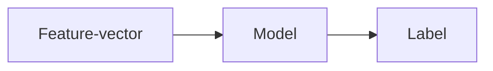
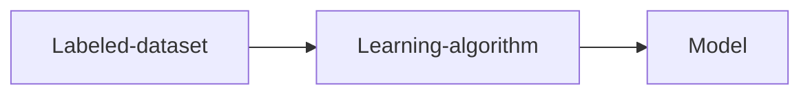
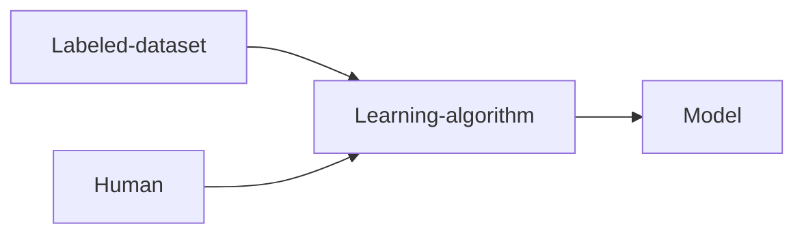

# ML problem

!!! question
	 What does a typical ML problem look like?

## Regression

### Analogy

Think about arithmetic classes in primary school. During the class hours, a student looks at solved examples in a textbook and **learns** how to solve simple three digit addition problems. Let us say that her textbook has the following problems along with the answers:

- $103 + 205 = 308$
- $123 + 409 = 532$
- $185 + 483 = 668$

During the instructional hours, the student has access to both the questions and the answers. In the exam, she will not have access to the answers! But more importantly, she will not even be asked the same questions! So, just memorizing the answers will not help. She would have to learn how addition works. She needs to have a mental model of addition. In other words, she would have to **learn a function** from the input (question) to the output (answer).

This is exactly what happens in a regression problem. The inputs are a set of data-points. The outputs corresponding to these inputs are real numbers called targets or **labels**. A regression model has to learn the mapping from input to output. Once this mapping or function is learnt, the model can then be used to predict the output on unseen inputs. The collection of data-points along with their targets is called a **labeled dataset**. A regression model makes use of this dataset to learn a function. A labeled dataset is nothing but the textbook problems in our analogy.

### Data Representation

We are given a collection of $m$ data-points and $m$ labels which are real numbers. Each data-point is described by $n$ features. For example, in the housing dataset, each house is a data-point and is described by features such as lattitude, longitude, area and so on. These features are clubbed together in a feature-vector of size $n$. Arranging the $m$ data-points in a matrix, we get a $m \times n$ data-matrix. Let us call this matrix $X$:

$$
X = \begin{bmatrix}
x_{11} & \cdots & x_{1n}\\
\vdots & x_{ij} & \vdots\\
x_{m1} & \cdots & x_{mn}
\end{bmatrix}
$$

Each row of this matrix is the feature vector for one data-point. The labels can be put together in a vector of size $n$. Let us call this $y$:

$$
y = \begin{bmatrix}
y_1\\
\vdots\\
y_m
\end{bmatrix}
$$

### Model

As stated earlier, a regression model can be viewed as a function that transforms a data-point into a label. Formally:

$$
f: \mathbb{R}^{n} \rightarrow \mathbb{R}
$$

Each feature-vector is of size $n$. So, the feature-vectors reside in the $n$ dimensional space $\mathbb{R}^{n}$. The labels are real numbers, so they reside in $\mathbb{R}$. Mathematically, this is the action of a model on a data-point $x$:

$$
y = f(x)
$$

Pictorially:

What is so special about a ML model? All models take some input and produce a corresponding output. The key difference is that in a classical programming setting, we are usually given the input and the function, we need to find the output. In machine learning we are given both the input and the output, we have to learn a model $f$. The function or the model is the unknown. This is what has to be learnt.

!!!tip
	You can think about an ML model as a function that maps a feature-vector to a label.

### Learning

ML is all about learning from data. But who or what is learning? More importantly, who or what enables the learning? There is a learning algorithm which drives the learning. We can think of the model as the outcome of the learning process. During the learning stage, the dataset is fed as input to a learning algorithm, which in turn outputs a model. 

There is one important detail that is missing in this diagram. There are several models from which we could choose from. Going back to our analogy, there are different ways to understand three digit addition:

- representing numbers as physical objects
- representing numbers as abstract objects

Teachers might might choose the first model to help kids understand addition. As kids grow up, teachers might move to the second model, which is more sophisticated. Something similar happens in ML. We are the teachers for the machines. So, we should pick a suitable family of models and offer it to the machine. The machine will then use our input and the learning algorithm to output a model.

!!! note
    For some regression models, once you have learnt the model, you can throw away the dataset (textbook). This is not true of all regression models though! Think about how you learnt three-digit addition. Do you still carry your primary school textbooks around? No! Your mind has a representation of what addition is. 

ML scientists have come up with a variety of models. The simplest such model is a linear model. We shall take this up in the week-3.

## Classification

Regression is one type of ML problem. Classification is another kind of ML problem, and perhaps the most popular. We shall begin with an example. 

## Summary

Regression is a classic ML problem where we use labeled data to learn a mapping from a feature-vector to a real number. The data-points are arranged in a data-matrix called $X$. The labels are arranged in a label vector called $y$. A model is a function that transforms a feature-vector to a label.
